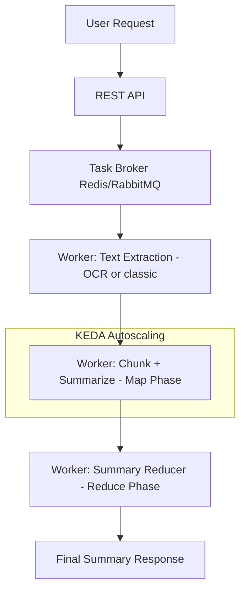

# Abrege

## Introduction

**Abrege** is a powerful summarization tool designed to generate concise summaries from large documents—without strict page limits. While technically scalable, it has been tested with documents up to **500 pages**.

Supported input formats:

* `.pdf`
* `.docx`
* `.odt`
* `.odp`
* `.png`
* URLs
* Raw text

## How It Works

Abrege uses an **asynchronous Map-Reduce architecture** to summarize large documents efficiently:

1. **Text Extraction**: the system retrieves the full text using either:

   * **Simple extraction** (e.g., PDF parsing)
   * **OCR** (for scanned documents or images)
2. **Chunking**: the extracted text is divided into sections that fit within the LLM's context window.
3. **Map Phase**: each chunk is summarized in parallel using asynchronous workers.
4. **Reduce Phase**: the intermediate summaries are aggregated into a final global summary.

The number of LLM calls is approximately:

```
total_calls ≈ total_tokens // llm_max_context + 1
```

The `+1` accounts for the final reduction step.

## Architecture Overview



### Key Components

* **API**: Accepts input documents and triggers the pipeline.
* **Broker**: Manages the asynchronous task queue.
* **Workers**:

  * Extract text (OCR or standard)
  * Chunk and summarize (Map phase)
  * Combine results (Reduce phase)
* **KEDA**: Scales summarization workers based on the queue size for parallelism.

## Run Locally with Docker Compose

To start the service locally:

```bash
docker compose up
```

This launches:

* The REST API
* Backend workers
* Required infrastructure (e.g., broker, database)

Ensure Docker and Docker Compose are installed and running on your machine.

## Run Unit Tests

Unit tests are defined in the `Makefile`. Available targets:

### Test the Core Service (`src`)

```bash
make test-src
```

This runs:

```makefile
docker compose up -d abrege_api
docker compose exec abrege_api uv run pytest -s --cov=./src --cov-report=term-missing tests/src/ -ra -v --maxfail=0
make down-services
```

### Test the API Layer

```bash
make test-abrege-api
```

This runs:

```makefile
docker compose up -d abrege_api
docker compose exec abrege_api uv run pytest -s --cov=./api --cov-report=term-missing tests/api/ -ra -v --maxfail=0
make down-services
```

### Test the Full Service via Runner

```bash
make test-abrege-service
```

This runs:

```makefile
docker compose run --rm test_runner
make down-services
```
