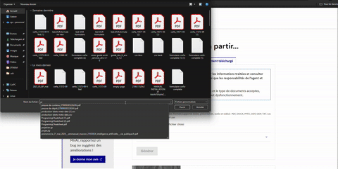
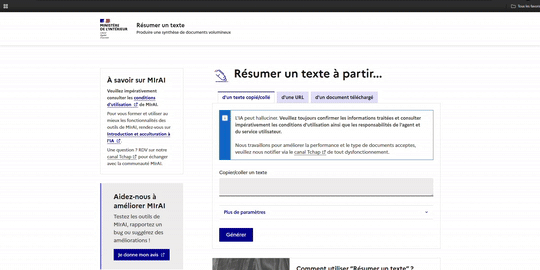

# Abrege

## 🔍 Overview

**Abrege** is a scalable document summarization tool built to handle **documents of any length**, i1. **Text Extraction**
   Retrieves the document's content using:

   * **Standard parsing** (e.g., for PDFs, Word files)
   * **OCR** (for scanned images or PDFs)ing those over **500 pages**. It supports various file formats and uses an intelligent **asynchronous Map-Reduce architecture** to deliver concise, high-quality summaries—no matter the input size.

Supported input formats:

* `.pdf`, `.docx`, `.odt`, `.odp`
* `.png` (via OCR)
* URLs
* Raw text

---

## Demo

| Document Summarization | Text Summarization | URL Summarization |
|:----------------------:|:-------------------:|:-----------------:|
|  |  |  |

---
## ⚙️ How It Works

Abrege breaks down the summarization process into three key phases:

1. **Text Extraction**
   Retrieves the document’s content using:

   * **Standard parsing** (e.g., for PDFs, Word files)
   * **OCR** (for scanned images or PDFs)

2. **Chunking**
   The text is split into manageable sections that fit within the LLM's context window.

3. **Summarization (Map-Reduce)**

   * **Map Phase**: Each chunk is summarized **in parallel** using async workers.
   * **Reduce Phase**: The partial summaries are merged into a final global summary.

> 📊 Total LLM calls ≈ `total_tokens // llm_max_context + 1`
> The `+1` is for the final reduction step.

---


##  Getting Started

### Prerequisites

Install system dependencies:

```bash
# For development environment
make install

# For system dependencies (Linux/macOS)
make install-local
```

### 🐳 Run Locally (Docker Compose)

Start the full stack:

```bash
# Launch development environment
make up

# Or use Docker Compose directly
docker compose up
```

For frontend development:

```bash
# Setup and launch frontend
make up-frontend
```

To stop services:

```bash
make down
```

### 🧱 Build Docker Images

```bash
# Build all images
make build

# Or build specific services
make build-abrege-api
make build-abrege-service
```

---

## 🧪 Testing

All tests are managed via the `Makefile`. Available test commands:

### Core Service Tests

```bash
make test-src
```

Tests the core `src` module with coverage reporting.

### API Tests

```bash
make test-abrege-api
```

Tests the API layer with coverage reporting.

### End-to-End Tests

```bash
make test-abrege-service
```

Runs comprehensive end-to-end tests via the test runner.

### 🧹 Development Tools

```bash
# Code linting
make lint

# Clean up cache and temporary files
make clean

# Clean frontend dependencies
make clean-front

# View all available commands
make help
```

---


## 🧱 Architecture

For a detailed sequence diagram of the document processing flow, see [docs/diagram.md](docs/diagram.md).

### Components

* **API**: Accepts inputs and initiates the processing pipeline.
* **Task Broker**: Handles message queueing (e.g., Redis, RabbitMQ).
* **Workers**:

  * Extract text from documents or images
  * Summarize chunks in parallel
  * Merge partial summaries
* **KEDA**: Automatically scales workers based on queue load.

---
