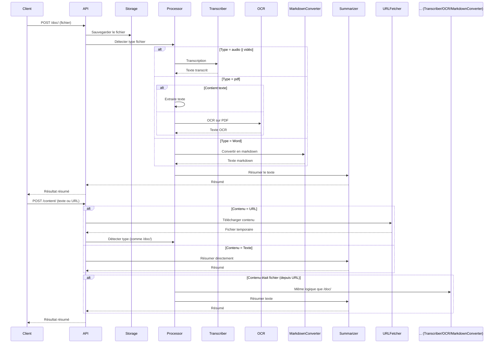

```mermaid
sequenceDiagram
    participant Client
    participant API
    participant Storage
    participant Processor
    participant Transcriber
    participant OCR
    participant MarkdownConverter
    participant Summarizer
    participant URLFetcher

    %% --- Route /doc/ ---
    Client->>API: POST /doc/ (fichier)
    API->>Storage: Sauvegarder le fichier
    API->>Processor: Détecter type fichier

    alt Type = audio || vidéo
        Processor->>Transcriber: Transcription
        Transcriber-->>Processor: Texte transcrit
    else Type = pdf
        alt Contient texte
            Processor->>Processor: Extraire texte
        else
            Processor->>OCR: OCR sur PDF
            OCR-->>Processor: Texte OCR
        end
    else Type = Word
        Processor->>MarkdownConverter: Convertir en markdown
        MarkdownConverter-->>Processor: Texte markdown
    end

    Processor->>Summarizer: Résumer le texte
    Summarizer-->>API: Résumé
    API-->>Client: Résultat résumé

    %% --- Route /content/ ---
    Client->>API: POST /content/ (texte ou URL)

    alt Contenu = URL
        API->>URLFetcher: Télécharger contenu
        URLFetcher-->>API: Fichier temporaire
        API->>Processor: Détecter type (comme /doc/)
    else Contenu = Texte
        API->>Summarizer: Résumer directement
        Summarizer-->>API: Résumé
    end

    alt Contenu était fichier (depuis URL)
        Processor->>... (Transcriber/OCR/MarkdownConverter): Même logique que /doc/
        Processor->>Summarizer: Résumer texte
        Summarizer-->>API: Résumé
    end

    API-->>Client: Résultat résumé
```
