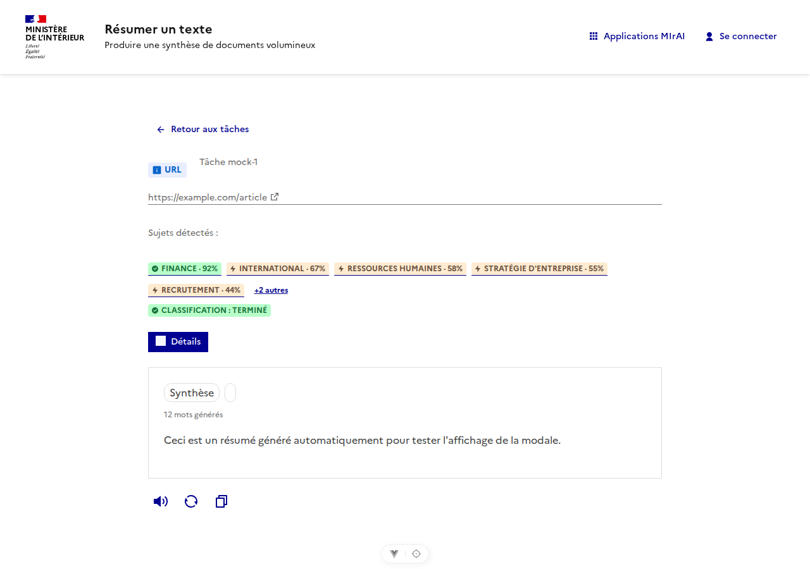
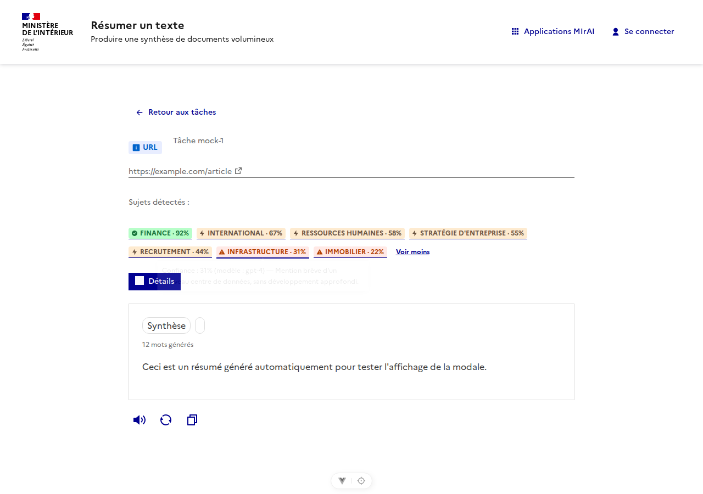
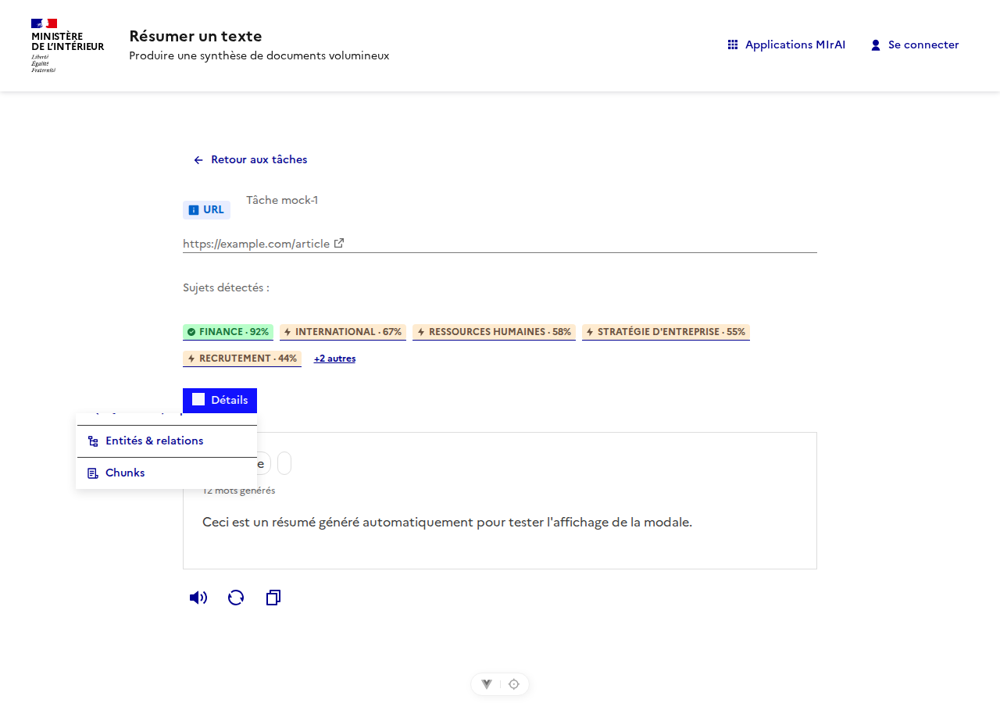
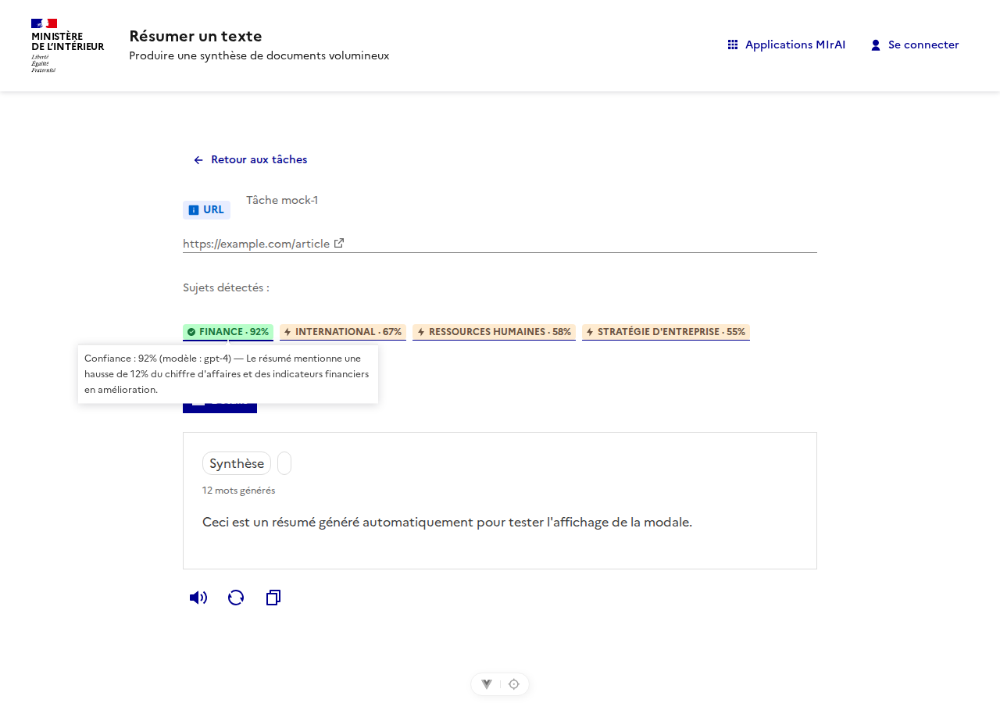
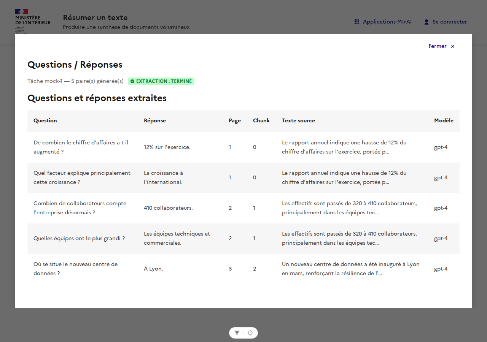
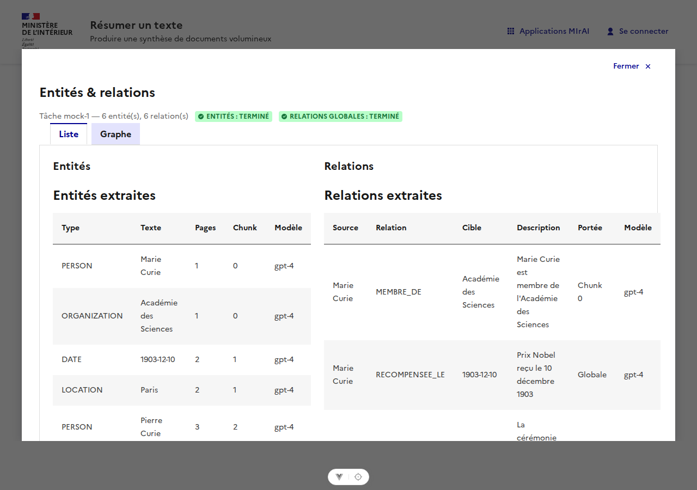
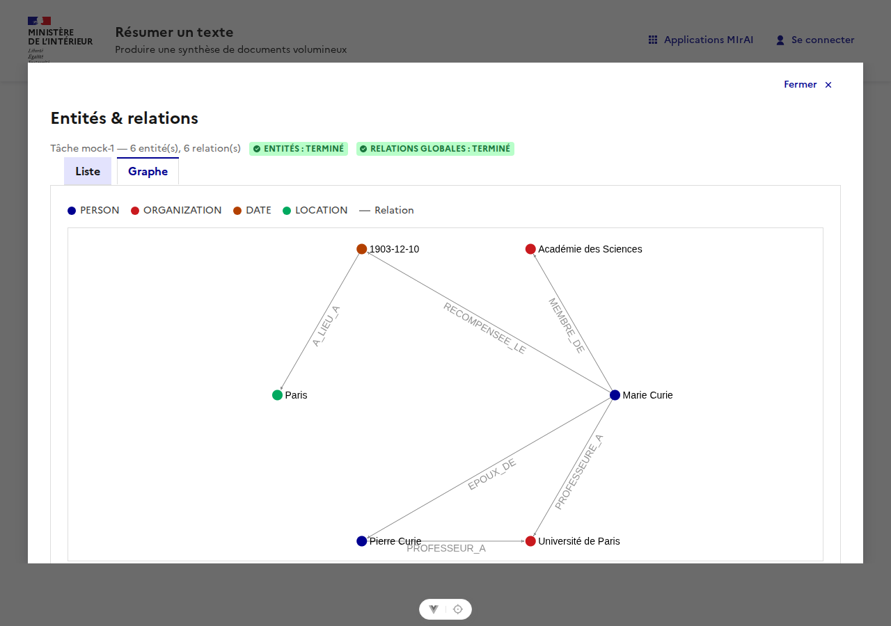
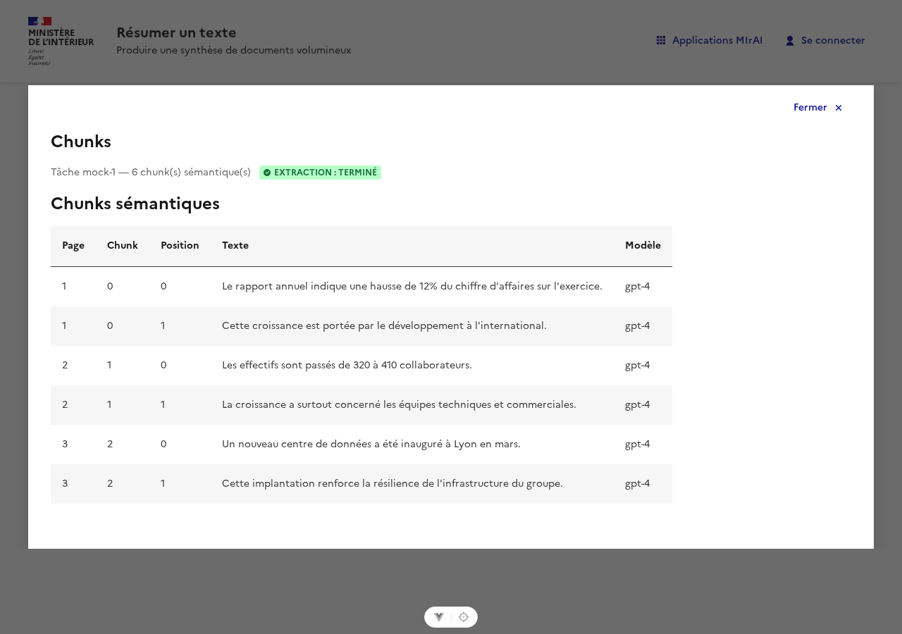
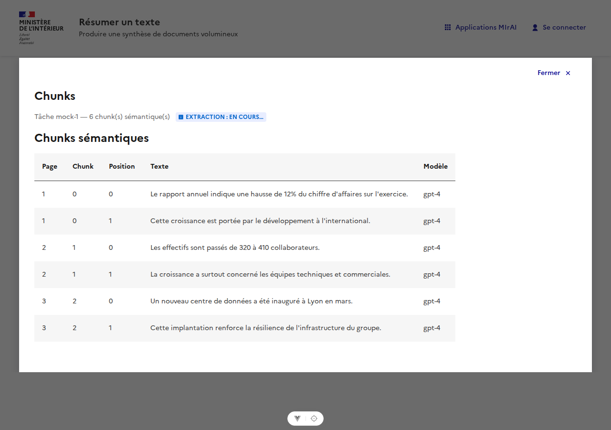

# 🔎 Document Insights

Beyond the summary itself, Abrege extracts several other pieces of information from a
document, so that everything worth knowing about it — the summary, its subjects, the
entities it mentions, how those entities relate to each other, the questions it answers,
and the exact chunks the LLM worked from — is available **in one place**: the task detail
page.

None of this blocks the summary. Each extraction runs as its own Celery task, fired at the
same point the map step already processes each chunk (or once the summary is ready, for
topic classification), and persisted independently. The summary is never slower because of
it, and a page reload — or the built-in status polling — always shows accurate progress.

## What gets extracted

| Feature | What it is | Runs on | Table |
|---|---|---|---|
| **Q&A** | Question/answer pairs, grounded in the source text | each chunk | `qa_items` |
| **Entities** | Named entities (people, dates, organizations, locations…) | each chunk | `entities` |
| **Relationships** | Links between entities — local (within a chunk) and global (inferred once every chunk is done, so entities from different chunks can be connected) | each chunk, then once globally | `relationships` |
| **Topics** | Free-form subject classification, with a confidence score and an explanation per topic | the final summary | `topics` |
| **Chunks** | The semantically coherent chunks an LLM produced for that map-step window (not a fixed word/token split) | each chunk | `chunks` |

Every row also records which LLM `model_name` produced it.

Each of these can be pinned to its own model, independently of the summary's — set
`QA_MODEL_NAME`, `ENTITY_MODEL_NAME` (also used for the global-relationships pass),
`CHUNK_MODEL_NAME` or `TOPIC_MODEL_NAME`. Left unset (the default), a feature simply reuses
the summary's own model (`OPENAI_API_MODEL`).

## Opt-in per task

None of this runs unless asked for. Each feature has its own boolean on `SummaryParameters`,
all `false` by default — a summary costs nothing extra unless a caller explicitly requests it:

| Parameter | Feature |
|---|---|
| `extract_qa` (+ `qa_per_chunk`, default `3`) | Q&A |
| `extract_entities` | Entities & relationships |
| `extract_chunks` | Chunks |
| `classify_topics` | Topics |

The frontend's "Plus de paramètres" panel exposes all four as toggles (off by default) when
creating a task. Only what was requested for a given task shows up on its detail page — see
below.

## Where to find it

On the task detail page, once a summary is `completed`, only the features that were requested
for that task (see above) appear at all:

- **Topics**, if `classify_topics` was set, are shown directly as badges — no click needed.
  Only the first few are shown, with a `+N autres` toggle for the rest, and a status badge
  next to them so you can tell classification is done (or still running) without opening
  anything. Not requested → no topics section, no badge.
- **Q&A**, **Entities & relations** and **Chunks**, for whichever were requested, are one
  click away behind a single **Analyse du document** button — it only lists the button(s) for
  what was actually extracted, and disappears entirely if none of the three were requested.

| Topics (collapsed) | Topics (expanded) | Details menu |
|:---:|:---:|:---:|
|  |  |  |

Hovering a topic badge explains the classification and shows the confidence score:



### Q&A



### Entities & relations

Two views on the same modal: a paginated list, or a graph (built with
[sigma.js](https://www.sigma-js.org/) + [graphology](https://graphology.github.io/)) that
visually tells entities (colored nodes, by type) apart from relationships (labeled edges).

| List | Graph |
|:---:|:---:|
|  |  |

### Chunks



## Knowing when it's done

Extraction is fire-and-forget, so the frontend needs a way to know whether it's still
running. Every task carries three independent status columns, alongside its own summary
`status`:

| Column | Values | Set when |
|---|---|---|
| `qa_entities_status` | `in_progress` → `completed` \| `failed` | whichever of Q&A/entities/chunks was requested (`extract_qa`/`extract_entities`/`extract_chunks`), dispatched together per chunk; the last chunk to finish flips this to `completed`. Stays `null` if none of the three were requested |
| `relationships_status` | `pending` → `completed` \| `failed` | the global relationships pass, only dispatched if `extract_entities` was requested, once `qa_entities_status` is `completed` |
| `topics_status` | `pending` → `completed` \| `failed` | topic classification, only dispatched if `classify_topics` was requested, fired right after the summary is ready |

Each column is written from exactly one place in the pipeline, so concurrent chunk workers
never race on the same field. These statuses are part of the regular `GET /task/{id}`
response — no extra endpoint needed — and every modal shows them as a small colored badge
(blue/pulsing while pending, green once done, red on failure). The task detail page polls
lightly (every 3s) while anything is still pending, so the indicator updates on its own.



## Architecture

```
worker.tasks.abrege (main summarize task)
  └─ map step, per chunk ──► worker.tasks.extract_chunk_details  (whichever of Q&A/entities/chunks was requested, in parallel)
                                   └─ last chunk done, if extract_entities ──► worker.tasks.compute_global_relationships
  └─ once summary is ready, if classify_topics ──► worker.tasks.classify_topics
```

- Not dispatched at all if none of `extract_qa`/`extract_entities`/`extract_chunks` were
  requested; within a dispatched `extract_chunk_details`, only the requested LLM calls run
  and only the corresponding rows are saved.
- Every extraction task is dispatched with `celery_app.send_task(...)` — a genuinely
  separate message, picked up by any available worker, as opposed to `asyncio.gather`
  which only parallelizes work *inside* the task that's already running.
- The worker never writes to these tables directly. It calls the API's internal-only CRUD
  routes (`POST /task/{id}/qa`, `/entities`, `/relationships/global`, `/topics`,
  `/chunks`), authenticated by a shared `INTERNAL_SERVICE_TOKEN` — the same database access
  pattern as the rest of the API, just reached over HTTP instead of the ORM directly.
- Each save is scoped to `(task_id, chunk_index)` and replaces that chunk's previous rows,
  so a Celery retry of one chunk never duplicates data or disturbs the other chunks.

## API

All routes are under `/task/{id}/...`, paginated (`offset`/`limit`) where they return a
list, and scoped to the task's owner:

| Resource | Read | Write (internal only) |
|---|---|---|
| Q&A | `GET /qa`, `GET /qa/{id}` | `POST /qa`, `DELETE /qa/{id}` |
| Entities | `GET /entities`, `GET /entities/{id}` | `POST /entities`, `DELETE /entities/{id}` |
| Relationships | `GET /relationships`, `GET /relationships/{id}` | `POST /relationships/global`, `DELETE /relationships/{id}` |
| Topics | `GET /topics`, `GET /topics/{id}` | `POST /topics`, `DELETE /topics/{id}` |
| Chunks | `GET /chunks`, `GET /chunks/{id}` | `POST /chunks`, `DELETE /chunks/{id}` |

A task summarized without `extract_qa`/`extract_entities`/`extract_chunks` (the default, or an
explicit choice) can still get Q&A/entities/chunks after the fact - this re-triggers all three
regardless of what was originally requested:

```
POST /task/{id}/extract-details
```
