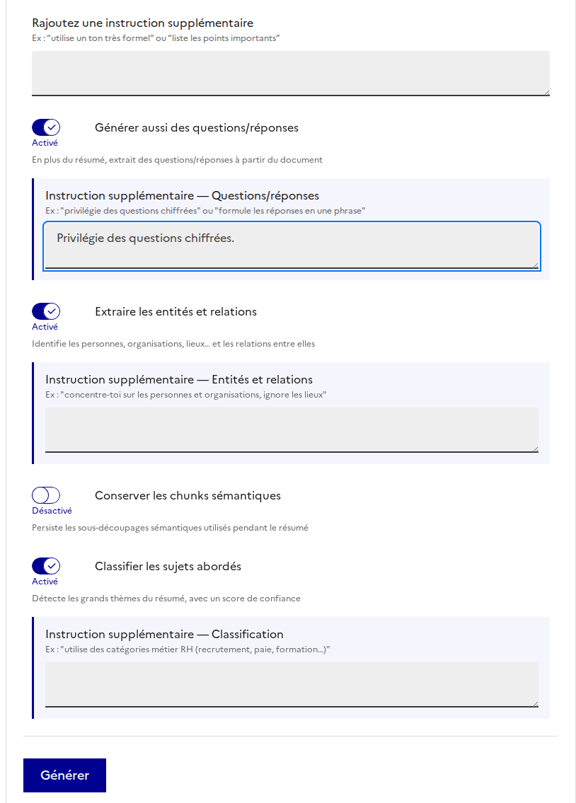
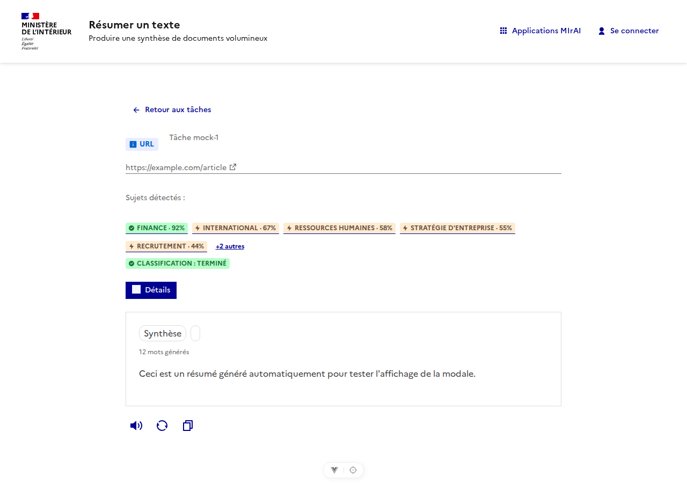
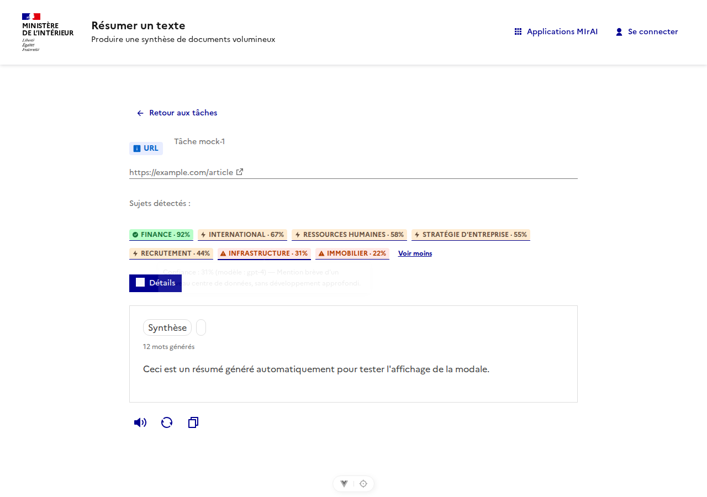
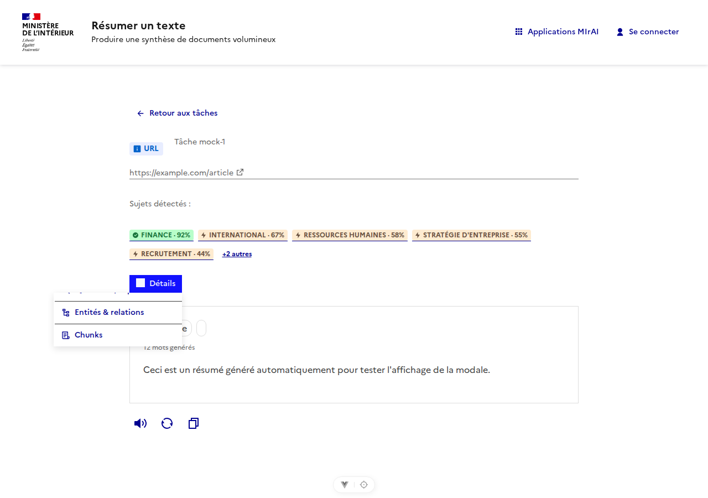
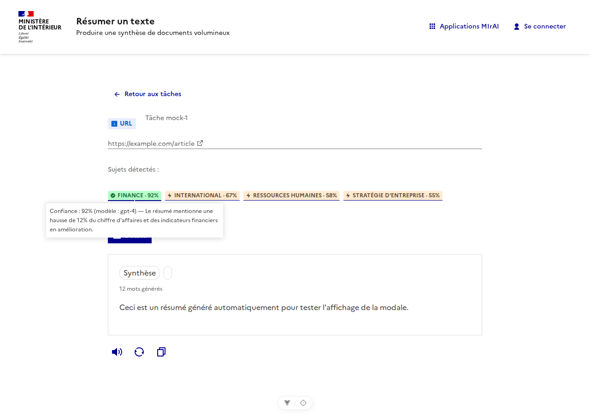
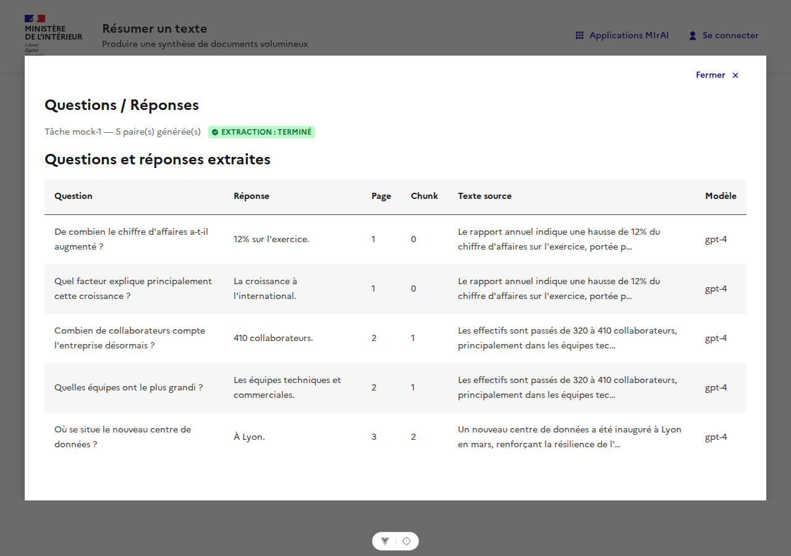
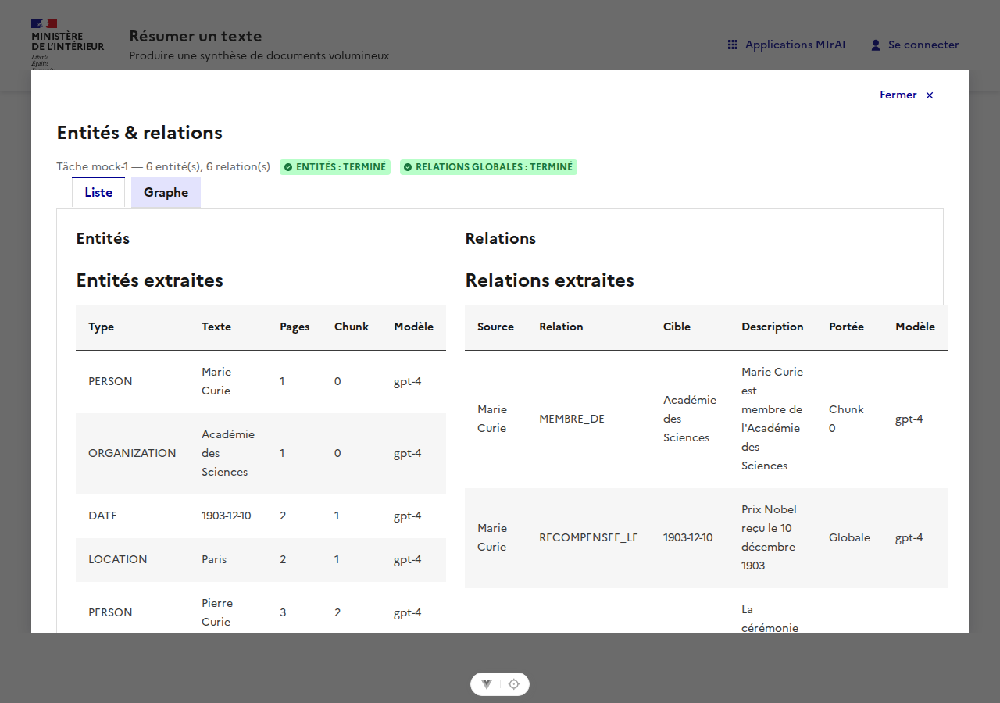
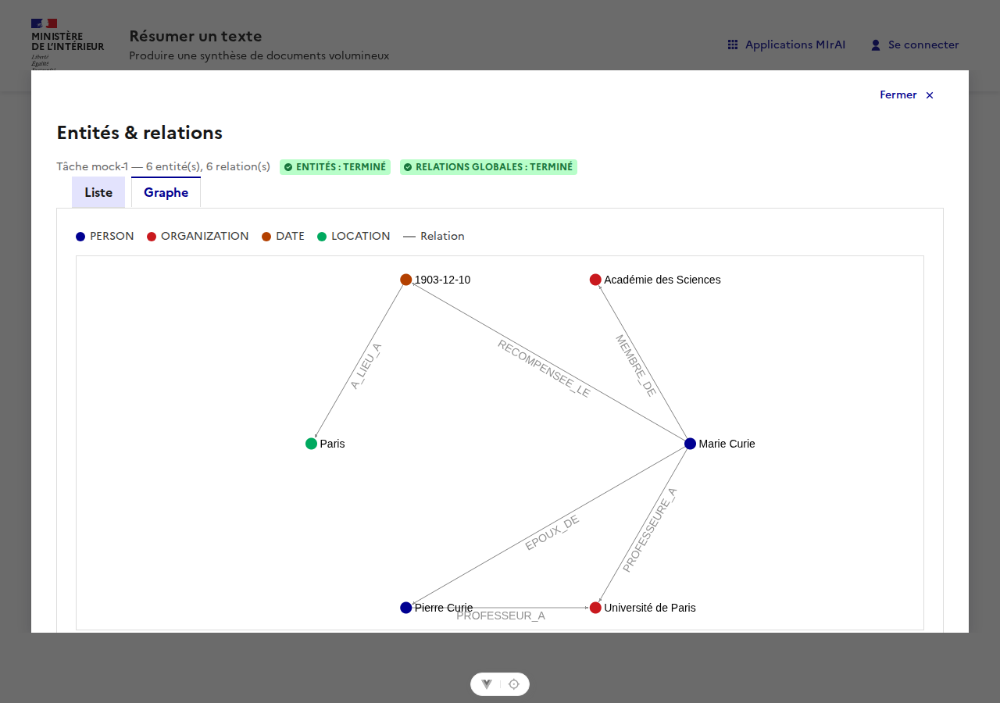
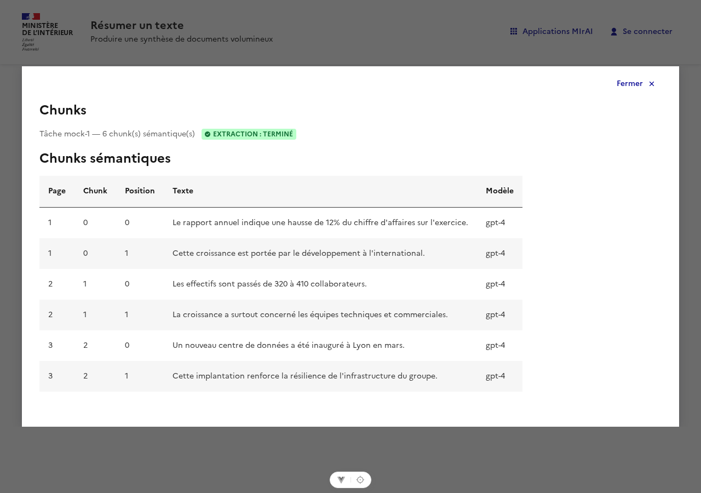
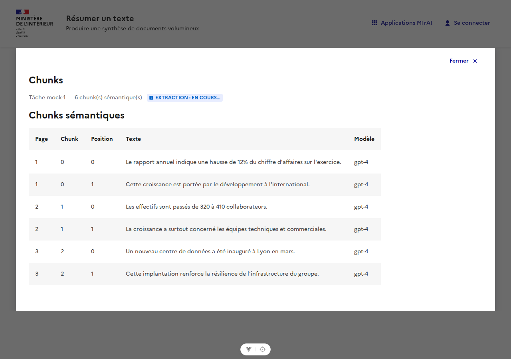

# 🔎 Document Insights

Beyond the summary itself, Abrege extracts several other pieces of information from a
document, so that everything worth knowing about it — the summary, its subjects, the
entities it mentions, how those entities relate to each other, the questions it answers,
and the exact chunks the LLM worked from — is available **in one place**: the task detail
page.

None of this blocks the summary. Each extraction runs as its own Celery task, fired at the
same point the map step already processes each chunk (or once the summary is ready, for
topic classification), and persisted independently. The summary is never slower because of
it, and a page reload — or the built-in status polling — always shows accurate progress.

## What gets extracted

| Feature | What it is | Runs on | Table |
|---|---|---|---|
| **Q&A** | Question/answer pairs, grounded in the source text | each chunk | `qa_items` |
| **Entities** | Named entities (people, dates, organizations, locations…) | each chunk | `entities` |
| **Relationships** | Links between entities — local (within a chunk) and global (inferred once every chunk is done, so entities from different chunks can be connected) | each chunk, then once globally | `relationships` |
| **Topics** | Free-form subject classification, with a confidence score and an explanation per topic | the final summary | `topics` |
| **Chunks** | The semantically coherent chunks an LLM produced for that map-step window (not a fixed word/token split) | each chunk | `chunks` |

Every row also records which LLM `model_name` produced it.

Each of these can be pinned to its own model, independently of the summary's — set
`QA_MODEL_NAME`, `ENTITY_MODEL_NAME` (also used for the global-relationships pass),
`CHUNK_MODEL_NAME` or `TOPIC_MODEL_NAME`. Left unset (the default), a feature simply reuses
the summary's own model (`OPENAI_API_MODEL`).

## Opt-in per task

None of this runs unless asked for. Each feature has its own boolean on `SummaryParameters`,
all `false` by default — a summary costs nothing extra unless a caller explicitly requests it:

| Parameter | Feature |
|---|---|
| `extract_qa` (+ `qa_per_chunk`, default `3`) | Q&A |
| `extract_entities` | Entities & relationships |
| `extract_chunks` | Chunks |
| `classify_topics` | Topics |

Each of these also has its own optional free-text instruction — `qa_instructions`,
`entities_instructions`, `chunks_instructions`, `topics_instructions` — appended to that
feature's own prompt only, independently of the summary's `custom_prompt`. Unset (the
default), the feature runs with no extra instruction. `entities_instructions` applies to
both the per-chunk entity extraction and the global cross-chunk relationships pass.

### Your own entity and topic definitions

Instructions are free text. For entities and topics you can go further and tell Abrege **what
to look for**, with structured definitions in the task parameters:

| Parameter | Effect |
|---|---|
| `entity_definitions` | The extraction **focuses on the listed entities only**: no other entity is extracted, even an important one, and relationships only link entities that were extracted. The definition's name becomes the entity `type`. |
| `topic_definitions` | The classification is steered towards your own subjects instead of inventing free-form ones. |

Each definition has a `name`, an optional `definition` (what the model should recognize) and
a list of `examples`. Entity definitions also have a `type` (`string`, `number`, `date`,
`boolean` or `enum`), and an `enum` needs its `enum_values`. Names must be unique
(case-insensitive); at most 50 definitions and 20 examples each. Without definitions the
behavior is unchanged. Definitions are only used when the matching feature is on
(`extract_entities` / `classify_topics`), and the free-text instruction still applies on top.

```json
{
  "extract_entities": true,
  "entity_definitions": [
    {"name": "date_signature", "type": "date", "definition": "Date de signature du contrat", "examples": ["12/03/2024"]},
    {"name": "statut", "type": "enum", "enum_values": ["ouvert", "fermé"]}
  ],
  "classify_topics": true,
  "topic_definitions": [
    {"name": "recrutement", "definition": "Offres d'emploi et entretiens", "examples": ["CDI", "fiche de poste"]}
  ]
}
```

They are rendered into the existing `{instructions}` slot of the entity and topic prompts
(`abrege_service/models/summary/definitions.py`); the prompts themselves do not change.

### In the frontend

The "Plus de paramètres" panel holds the summary options (language, length, custom
instruction) and a collapsible **Paramètres avancés** section. It shows one card at a time —
Questions/réponses, Entités et relations, Chunks sémantiques, Classification des sujets —
each with a plain-language description of what it does, and **Précédent / Suivant** buttons
that name the next card (with its description as a tooltip). Each card has its toggle and its
instruction field; the entities and topics cards also have a **definitions editor**: collapsible
cards (name, type for entities, definition, examples list) that are collapsed with *Terminer*
before moving on to the next one.



> The screenshots of this page predate the redesign of the advanced parameters and of the
> results (below): the content they show is still accurate, the layout is not.

Only what was requested for a given task shows up on its detail page — see below.

## Where to find it

On the task detail page, once a summary is `completed`, only the features that were requested
for that task (see above) appear at all:

- **Topics**, if `classify_topics` was set, are shown directly in a card above the summary:
  each topic has a confidence meter (green from 70%, blue from 40%, orange below), and its
  explanation is one click away behind **Voir la raison**. Only the first five are shown, with
  a link to reveal the rest, and the classification status badge sits at the top right of the
  card. Not requested → no topics card.
- **Q&A**, **Entities & relations**, **Chunks** and **Topics**, for whichever were requested,
  are also reachable behind a single **Analyse du document** button. It opens one modal that
  walks through the requested features one card at a time, with **Précédent / Suivant**
  buttons naming the next card (and a tooltip describing it). The button disappears entirely
  if nothing was requested.

| Topics (collapsed) | Topics (expanded) | Details menu |
|:---:|:---:|:---:|
|  |  |  |

Each topic's reason is collapsed by default and expands on demand:



### Q&A



### Entities & relations

Two views in the same card: a list (entities, then relations, stacked so the tables never
overflow the modal), or a graph (built with
[sigma.js](https://www.sigma-js.org/) + [graphology](https://graphology.github.io/)) that
visually tells entities (colored nodes, by type) apart from relationships (labeled edges).

| List | Graph |
|:---:|:---:|
|  |  |

### Chunks



## Knowing when it's done

Extraction is fire-and-forget, so the frontend needs a way to know whether it's still
running. Every task carries three independent status columns, alongside its own summary
`status`:

| Column | Values | Set when |
|---|---|---|
| `qa_entities_status` | `in_progress` → `completed` \| `failed` | whichever of Q&A/entities/chunks was requested (`extract_qa`/`extract_entities`/`extract_chunks`), dispatched together per chunk; the last chunk to finish flips this to `completed`. Stays `null` if none of the three were requested |
| `relationships_status` | `pending` → `completed` \| `failed` | the global relationships pass, only dispatched if `extract_entities` was requested, once `qa_entities_status` is `completed` |
| `topics_status` | `pending` → `completed` \| `failed` | topic classification, only dispatched if `classify_topics` was requested, fired right after the summary is ready |

Each column is written from exactly one place in the pipeline, so concurrent chunk workers
never race on the same field. These statuses are part of the regular `GET /task/{id}`
response — no extra endpoint needed — and every result card shows them as a small colored badge
(blue/pulsing while pending, green once done, red on failure). The task detail page polls
lightly (every 3s) while anything is still pending, so the indicator updates on its own.



## Architecture

```
worker.tasks.abrege (main summarize task)
  └─ map step, per chunk ──► worker.tasks.extract_chunk_details  (whichever of Q&A/entities/chunks was requested, in parallel)
                                   └─ last chunk done, if extract_entities ──► worker.tasks.compute_global_relationships
  └─ once summary is ready, if classify_topics ──► worker.tasks.classify_topics
```

- Not dispatched at all if none of `extract_qa`/`extract_entities`/`extract_chunks` were
  requested; within a dispatched `extract_chunk_details`, only the requested LLM calls run
  and only the corresponding rows are saved.
- Every extraction task is dispatched with `celery_app.send_task(...)` — a genuinely
  separate message, picked up by any available worker, as opposed to `asyncio.gather`
  which only parallelizes work *inside* the task that's already running.
- The worker never writes to these tables directly. It calls the API's internal-only CRUD
  routes (`POST /task/{id}/qa`, `/entities`, `/relationships/global`, `/topics`,
  `/chunks`), authenticated by a shared `INTERNAL_SERVICE_TOKEN` — the same database access
  pattern as the rest of the API, just reached over HTTP instead of the ORM directly.
- Each save is scoped to `(task_id, chunk_index)` and replaces that chunk's previous rows,
  so a Celery retry of one chunk never duplicates data or disturbs the other chunks.

## API

All routes are under `/api/task/{id}/...` and scoped to the task's owner. Lists are paginated with
`offset` and `limit`; despite its name, **`offset` is a 1-based page number**, `limit` the page size.
The full, always up-to-date reference (parameters, responses, schemas) is the Swagger UI at
`/api/docs`.

| Resource | Read | Delete (owner) | Write (internal only, worker) |
|---|---|---|---|
| Q&A | `GET /qa`, `GET /qa/{id}` | `DELETE /qa/{id}` | `POST /qa` |
| Entities | `GET /entities`, `GET /entities/{id}` | `DELETE /entities/{id}` | `POST /entities` |
| Relationships | `GET /relationships`, `GET /relationships/{id}` | `DELETE /relationships/{id}` | `POST /relationships/global` |
| Topics | `GET /topics` | `DELETE /topics/{id}` | `POST /topics` |
| Chunks | `GET /chunks`, `GET /chunks/{id}` | `DELETE /chunks/{id}` | `POST /chunks` |

The write routes require the `X-Internal-Token` header (`INTERNAL_SERVICE_TOKEN`) and are
not meant for end users.

A task summarized without `extract_qa`/`extract_entities`/`extract_chunks` (the default, or an
explicit choice) can still get Q&A/entities/chunks after the fact - this re-triggers all three
regardless of what was originally requested:

```
POST /task/{id}/extract-details
```
